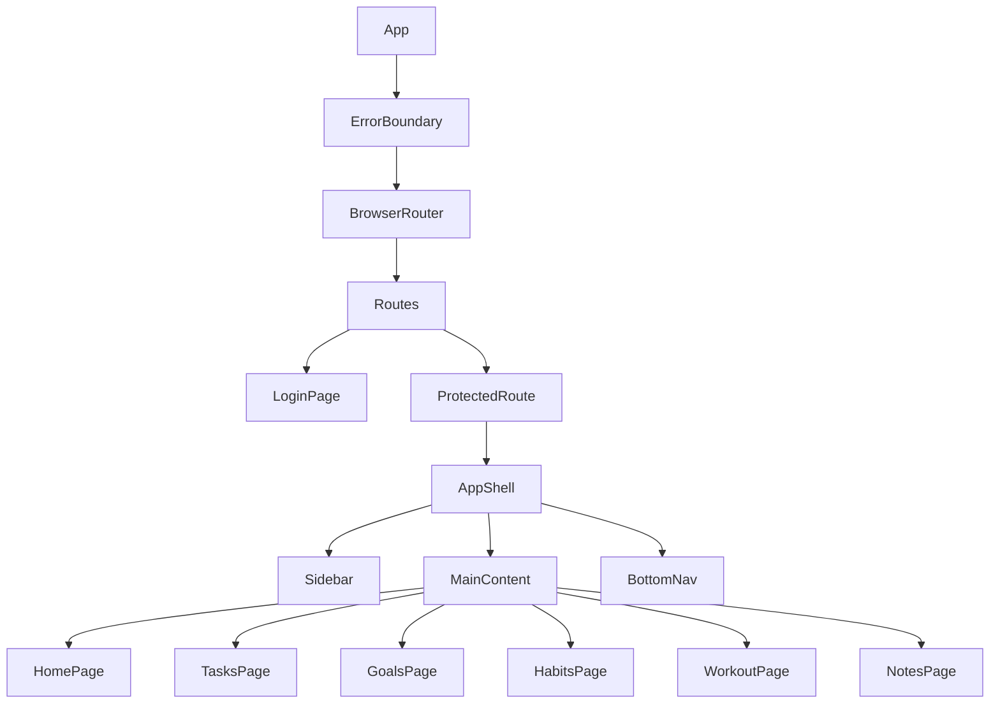

# Architecture & Structure

## Folder Structure

```
src/
├── App.tsx                 # Main app component with routing
├── main.tsx               # Application entry point
├── index.css              # Global styles and Tailwind imports
├── vite-env.d.ts          # Vite type declarations
│
├── components/            # Shared/reusable components
│   ├── ui/               # UI primitives (Button, Input, Card, etc.)
│   │   ├── Button.tsx
│   │   ├── Card.tsx
│   │   ├── Input.tsx
│   │   ├── LoadingSpinner.tsx
│   │   └── index.ts
│   ├── layout/           # Layout components
│   │   ├── AppShell.tsx  # Main app layout wrapper
│   │   ├── BottomNav.tsx # Mobile bottom navigation
│   │   ├── Sidebar.tsx   # Desktop sidebar navigation
│   │   └── index.ts
│   ├── DayOverview.tsx   # Daily summary component
│   └── ErrorBoundary.tsx # React error boundary
│
├── features/             # Feature-based modules (domain logic)
│   ├── todos/           # Task management feature
│   │   ├── TasksPage.tsx
│   │   ├── components/
│   │   │   ├── AddTaskForm.tsx
│   │   │   ├── AddTaskModal.tsx
│   │   │   ├── TaskItem.tsx
│   │   │   ├── TaskList.tsx
│   │   │   └── Toast.tsx
│   │   └── hooks/
│   │       ├── useTasks.ts
│   │       └── useAllTasks.ts
│   │
│   ├── goals/           # Goal tracking feature
│   │   ├── GoalsPage.tsx
│   │   ├── components/
│   │   │   ├── AddGoalModal.tsx
│   │   │   ├── GoalCard.tsx
│   │   │   ├── GoalFilters.tsx
│   │   │   ├── GoalsList.tsx
│   │   │   ├── KanbanBoard.tsx
│   │   │   ├── KanbanColumn.tsx
│   │   │   └── ProgressBar.tsx
│   │   ├── hooks/
│   │   │   └── useGoals.ts
│   │   └── lib/
│   │       └── progress.ts
│   │
│   ├── habits/          # Habit tracking feature
│   │   ├── HabitsPage.tsx
│   │   ├── components/
│   │   │   ├── AddHabitModal.tsx
│   │   │   ├── ColorPicker.tsx
│   │   │   ├── ContributionGraph.tsx
│   │   │   ├── HabitCalendar.tsx
│   │   │   ├── HabitCard.tsx
│   │   │   ├── HabitDetailModal.tsx
│   │   │   ├── HabitList.tsx
│   │   │   └── HabitStats.tsx
│   │   └── hooks/
│   │       ├── useHabits.ts
│   │       └── useHabitLogs.ts
│   │
│   ├── workout/         # Workout logging feature
│   │   ├── WorkoutPage.tsx
│   │   ├── components/
│   │   │   ├── ExerciseBuilder.tsx
│   │   │   ├── ExerciseHistory.tsx
│   │   │   ├── LiveWorkout.tsx
│   │   │   ├── QuickAdjust.tsx
│   │   │   ├── RestBetweenExercises.tsx
│   │   │   ├── RestTimer.tsx
│   │   │   ├── SessionCard.tsx
│   │   │   ├── SetDisplay.tsx
│   │   │   ├── SkippedExercises.tsx
│   │   │   ├── TemplateBuilder.tsx
│   │   │   ├── TemplateCard.tsx
│   │   │   ├── TemplateList.tsx
│   │   │   ├── WorkoutControls.tsx
│   │   │   ├── WorkoutHistory.tsx
│   │   │   └── WorkoutTimer.tsx
│   │   ├── hooks/
│   │   │   ├── useWorkoutSession.ts
│   │   │   ├── useWorkoutSessions.ts
│   │   │   └── useWorkoutTemplates.ts
│   │   └── lib/
│   │       ├── progressiveOverload.ts
│   │       └── workoutEngine.ts
│   │
│   ├── notes/           # Canvas-based notes feature
│   │   ├── NotesPage.tsx
│   │   ├── components/
│   │   │   ├── CanvasView.tsx
│   │   │   ├── FloatingEdge.tsx
│   │   │   ├── FloatingToolbar.tsx
│   │   │   ├── GroupNode.tsx
│   │   │   ├── ImageNode.tsx
│   │   │   ├── LinkNode.tsx
│   │   │   ├── MobileCanvasContext.tsx
│   │   │   ├── MobileCanvasView.tsx
│   │   │   ├── MobileNoteEditor.tsx
│   │   │   ├── MobileNotesView.tsx
│   │   │   ├── NoteNode.tsx
│   │   │   ├── NotesCanvas.tsx
│   │   │   ├── NotesLibrarySidebar.tsx
│   │   │   ├── StandaloneNoteEditor.tsx
│   │   │   └── TabStrip.tsx
│   │   └── hooks/
│   │       ├── useCanvases.ts
│   │       ├── useCanvasGroups.ts
│   │       └── useFolders.ts
│   │
│   └── gamification/    # XP and rank system
│       ├── utils.ts     # XP calculations, rank definitions
│       ├── components/
│       │   ├── RankDisplay.tsx
│       │   ├── RankOverview.tsx
│       │   ├── SettingsMenu.tsx
│       │   └── StatCard.tsx
│       └── hooks/
│           ├── useProfile.ts
│           ├── useProfileStats.ts
│           └── useRankDecay.ts
│
├── hooks/               # Shared custom hooks
│   ├── useAuth.ts       # Authentication hook
│   └── useScrollLock.ts # Scroll lock utility
│
├── lib/                 # Core utilities
│   ├── supabase.ts      # Supabase client configuration
│   ├── types.ts         # TypeScript type definitions
│   ├── logger.ts        # Logging utility
│   └── dateUtils.ts     # Date formatting helpers
│
├── pages/               # Page-level components
│   ├── HomePage.tsx     # Dashboard home page
│   ├── LoginPage.tsx    # Authentication page
│   └── NotFoundPage.tsx # 404 page
│
└── stores/              # Zustand state stores
    ├── authStore.ts     # Authentication state
    ├── notesStore.ts    # Notes/canvas state (with undo/redo)
    ├── profileStore.ts  # User profile & gamification
    ├── sidebarStore.ts  # Sidebar collapse state
    ├── themeStore.ts    # Theme preferences
    ├── workspaceStore.ts # Notes workspace tabs
    └── workoutSessionStore.ts # Active workout session
```

## Component Hierarchy



## Data Flow

### State Management with Zustand

The app uses Zustand for global state management. Each store is responsible for a specific domain:

```
┌─────────────────────────────────────────────────────────────┐
│                        Components                            │
└─────────────────────┬───────────────────────────────────────┘
                      │ useStore hooks
                      ▼
┌─────────────────────────────────────────────────────────────┐
│                     Zustand Stores                           │
│  ┌──────────┐ ┌──────────┐ ┌──────────┐ ┌──────────────┐   │
│  │authStore │ │notesStore│ │themeStore│ │profileStore  │   │
│  └──────────┘ └──────────┘ └──────────┘ └──────────────┘   │
└─────────────────────┬───────────────────────────────────────┘
                      │ Supabase client
                      ▼
┌─────────────────────────────────────────────────────────────┐
│                   Supabase Backend                           │
│  ┌──────────────┐ ┌──────────────┐ ┌──────────────┐        │
│  │Authentication│ │   Database   │ │   Storage    │        │
│  └──────────────┘ └──────────────┘ └──────────────┘        │
└─────────────────────────────────────────────────────────────┘
```

### Feature Data Hooks

Each feature has custom hooks that encapsulate data fetching and mutations:

- `useTasks()` - CRUD operations for tasks
- `useGoals()` - Goal management with progress tracking
- `useHabits()` / `useHabitLogs()` - Habit tracking
- `useWorkoutTemplates()` / `useWorkoutSessions()` - Workout data
- `useCanvases()` / `useFolders()` - Notes organization

### Optimistic Updates Pattern

The app uses optimistic updates for better UX:

1. Update local state immediately
2. Send request to Supabase
3. On error, revert local state or refetch

Example from `notesStore.ts`:
```typescript
updateNoteContent: async (noteId, title, content) => {
  // 1. Optimistic update
  set((state) => ({
    nodes: state.nodes.map((node) =>
      node.id === noteId ? { ...node, data: { ...node.data, title, content } } : node
    ),
  }));

  // 2. Database update
  const { error } = await supabase
    .from('notes')
    .update({ title, content })
    .eq('id', noteId);

  // 3. Error handling
  if (error) {
    void get().fetchCanvasNotes(currentCanvasId);
  }
}
```

## Authentication Flow

```
┌──────────────┐     ┌──────────────┐     ┌──────────────┐
│  App Mount   │────>│ initialize() │────>│ getSession() │
└──────────────┘     └──────────────┘     └──────────────┘
                                                 │
                     ┌───────────────────────────┼───────────────────────────┐
                     │                           │                           │
                     ▼                           ▼                           ▼
              ┌──────────────┐           ┌──────────────┐           ┌──────────────┐
              │ Has Session  │           │  No Session  │           │   Timeout    │
              │   (User)     │           │   (null)     │           │   (5 sec)    │
              └──────────────┘           └──────────────┘           └──────────────┘
                     │                           │                           │
                     ▼                           ▼                           ▼
              ┌──────────────┐           ┌──────────────┐           ┌──────────────┐
              │ Show App     │           │ Redirect to  │           │ Show Error   │
              │   Shell      │           │   Login      │           │   + Retry    │
              └──────────────┘           └──────────────┘           └──────────────┘
```

## Route Structure

| Path | Component | Auth Required |
|------|-----------|---------------|
| `/login` | LoginPage | No |
| `/` | Redirect to `/home` | Yes |
| `/home` | HomePage | Yes |
| `/tasks` | TasksPage | Yes |
| `/goals` | GoalsPage | Yes |
| `/habits` | HabitsPage | Yes |
| `/workout` | WorkoutPage | Yes |
| `/notes` | NotesPage | Yes |
| `*` | NotFoundPage | No |

## Code Splitting

Feature pages are lazy-loaded for better initial load performance:

```typescript
const HomePage = lazy(() => import('@/pages/HomePage'));
const TasksPage = lazy(() => import('@/features/todos/TasksPage'));
// etc.
```

Route preloading is available via `preloadRoute()` for instant navigation on hover/focus.

---

*Last updated: 2025-12-30*
